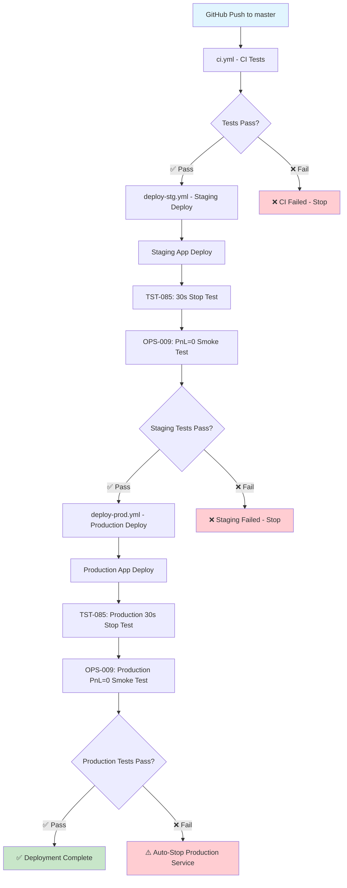
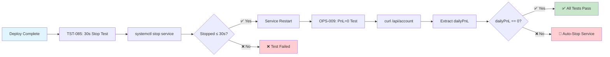

# GitHub Actions ワークフロー詳細ガイド

## 概要

SOL-Botプロジェクトでは、以下のGitHub Actionsワークフローを使用してCI/CDパイプラインを構築しています。

## 🔄 CI/CDパイプライン全体図



### 🔍 テストフロー詳細



## 📋 ワークフロー一覧

**現在のワークフローファイル構成** (CICD-009完了後):
- `deploy-stg.yml` - ステージング環境デプロイ
- `deploy-prod.yml` - 本番環境デプロイ  
- `ci.yml` - CI（テスト・ビルド）
- `security-scan.yml` - セキュリティスキャン（統合済み）
- `pr-todo-auto-update.yml` - PRタスク自動更新
- `pr-label-check.yml` - PRラベル検証

### デプロイメント系

#### 1. Deploy to Staging (`deploy-stg.yml`) ✅
**目的**: ステージング環境への自動デプロイ  
**トリガー**: `master`ブランチへのpush  
**実行環境**: Ubuntu Latest + Amazon Linux 2023 (EC2)

**処理フロー**:
1. **ソースコード準備**: rsync+SCPでソースコードをEC2に転送
2. **環境構築**: Node.js 18インストール・NPMアップデート
3. **アプリケーションビルド**: TypeScriptコンパイル（`src/` → `dist/`）
4. **systemdサービス設定**: bot.serviceファイル作成・強制更新
5. **サービス起動**: systemctl start + ヘルスチェック
6. **統合テスト**: 
   - TST-085: 30秒以内サービス停止テスト
   - OPS-009: PnL=0 Smokeテスト
7. **通知**: Discord通知（成功・失敗）

**特徴**:
- here-document構文エラー修正済み
- TypeScriptビルド対応（`ExecStart=/usr/bin/node dist/index.js`）
- ヘルスチェックエンドポイント（`/api/status`）での起動確認
- Discord通知の条件付き実行（Webhook URL設定時のみ）

**対象EC2**: `ec2-13-158-58-241.ap-northeast-1.compute.amazonaws.com`

---

#### 2. Deploy to Production (`deploy-prod.yml`) ✅
**目的**: 本番環境への制御されたデプロイ  
**トリガー**: `master`ブランチpush + 手動実行(`workflow_dispatch`)  
**実行環境**: Ubuntu Latest + Amazon Linux 2023 (EC2) - 1台構成

**処理フロー**:
1. **ソースコード準備**: rsync+SCPでソースコードをEC2に転送
2. **環境構築**: Node.js 18インストール・NPMアップデート
3. **アプリケーションビルド**: TypeScriptコンパイル（`src/` → `dist/`）
4. **systemdサービス設定**: bot-prod.serviceファイル作成・強制更新
5. **サービス起動**: systemctl start + ヘルスチェック（ポート3001）
6. **統合テスト**: 
   - TST-085: 30秒以内サービス停止テスト（本番）
   - OPS-009: PnL=0 Smokeテスト（失敗時自動停止）
7. **通知**: Discord通知（成功・失敗）

**特徴**:
- SSM Parameter Store対応（`/solbot/prod/env`）
- 1台構成（ステージングと本番が同居、ディレクトリ分離）
- ポート分離（Staging: 3000, Production: 3001）
- 本番専用systemdサービス（`bot-prod.service`）
- 統合テスト自動実行（サービス停止・復旧テスト）

**対象EC2**: `ec2-13-158-58-241.ap-northeast-1.compute.amazonaws.com`

---

## 🧪 統合テスト詳細

### TST-085: 30秒停止テスト

**目的**: サービスが30秒以内に安全に停止できることを確認  
**実行環境**: ステージング・本番両環境  

**テスト手順**:
1. サービス稼働状態確認
2. `systemctl stop` コマンド実行
3. 停止時間が30秒以内かを測定
4. サービス再起動・動作確認

**成功条件**: 
- 停止時間 ≤ 30秒
- サービス正常再起動
- ヘルスチェック成功

### OPS-009: PnL=0 Smokeテスト

**目的**: デプロイ後のPnL（損益）が0であることを確認  
**実行環境**: ステージング・本番両環境  

**テスト手順**:
1. `/api/account` エンドポイントアクセス
2. `dailyPnL` 値の抽出
3. 値が0であることを確認
4. 追加の健全性チェック実行

**成功条件**: 
- `dailyPnL === 0`
- API正常応答
- 残高チェック通過

**安全機能**: 
- **本番環境でテスト失敗時は自動的にサービス停止**
- GitHub Status も RED に設定
- Discord 通知で即座にアラート

### OBS-009: /metrics エンドポイント

**目的**: Prometheus形式のメトリクスを公開し、監視システムとの統合を実現  
**実装場所**: `index.ts` の `/metrics` エンドポイント  

**公開メトリクス**:
- `solbot_account_balance`: 現在の残高
- `solbot_daily_pnl`: 日次損益
- `solbot_orders_total`: 注文総数
- `solbot_uptime_seconds`: アプリケーション稼働時間

**Prometheus設定**:
- ステージング: `ec2-13-158-58-241:3000/metrics`
- 本番: `ec2-13-158-58-241:3001/metrics`
- 収集間隔: 30秒

**安全機能**:
- prom-client統合とフォールバック機能
- エラー時も基本メトリクスを提供
- 機密情報を含まない安全な設計

---

### テスト・品質管理系

#### 3. CI/CD Pipeline (`ci.yml`) ✅ 整理完了
**目的**: 継続的インテグレーション（テスト・ビルド専用）  
**トリガー**: push、pull_request

**処理内容**:
- **test**ジョブ:
  - 並列テスト実行（fast/medium/slow/core/heavy）
  - PRでの未完了Todoタスクチェック
- **build**ジョブ:
  - TypeScriptビルド
  - distアーティファクト保存

**特徴** (CICD-008で完了):
- デプロイ機能を専用ワークフローに分離
- CommonJS統一環境でのテスト実行
- 古いPM2/SSH設定完全削除
- Node.js 18に統一

---


### セキュリティ系

#### 6. Security Scan (`security-scan.yml`) ✅ 統合強化完了
**目的**: 包括的なセキュリティチェック  
**トリガー**: push、pull_request、毎日UTC 0:00、週次詳細スキャン、手動実行

**処理内容**:
- **secrets-scan**: gitleaksによる機密情報漏洩検出
- **dependency-scan**: Trivyによる詳細脆弱性チェック（旧trivy-dependency-scan.yml統合）
- **sbom-generation**: CycloneDXによるSBOM生成
- **security-report**: 統合レポート生成

**特徴**:
- SARIF形式でGitHub Securityタブに統合
- PRに詳細脆弱性サマリーを自動コメント（上位5件表示）
- 重大度レベル別の集計表示
- 手動実行時の重大度カスタマイズ対応
- JSONレポート生成とアーティファクト保存

---


### 運用管理系

#### 4. PR Todo Auto Update (`pr-todo-auto-update.yml`)
**目的**: PRマージ時のTodoタスク自動更新  
**トリガー**: pull_request (closed)  
**処理**: PRタイトルのタスクIDを[x]完了状態に更新

#### 5. PR Label Check (`pr-label-check.yml`)
**目的**: PRラベル検証  
**トリガー**: pull_request  
**処理**: 必須ラベルの確認

---

## 🔧 使用方法

### 手動デプロイ実行

本番環境への手動デプロイ：
```bash
# GitHub Actions タブで "Deploy to Production" を選択
# workflow_dispatch で手動実行
# 理由を入力（例：「緊急バグ修正」）
```

### ワークフロー監視

```bash
# ワークフロー状況確認
gh run list --workflow=deploy-stg.yml

# 特定の実行詳細確認
gh run view <run-id>

# ログ確認
gh run view <run-id> --log
```

### セキュリティスキャン結果確認

1. **GitHub Security タブ**: SARIF形式の脆弱性情報
2. **Actions アーティファクト**: 詳細レポート（JSON形式）
3. **PRコメント**: 脆弱性サマリー自動通知

---

## 🎯 改善計画

### 短期（W12スプリント）
- **CICD-007**: ✅ `deploy-prod.yml`のSSM対応・modernization完了
- **CICD-008**: ✅ `ci.yml`の機能整理・重複排除完了
- **CICD-009**: ✅ `trivy-dependency-scan.yml`削除・`security-scan.yml`統合完了

### 中期（W13-W14スプリント）
- Blue/Green デプロイメントの実装
- Parameter Store integration
- 監視システム（Prometheus/Grafana）との統合

### 長期
- マルチ環境デプロイ（dev/staging/prod）
- カナリアデプロイメント
- 自動ロールバック機能

---

## 📚 関連ドキュメント

- [systemdデプロイメントガイド](systemd-deployment.md)
- [AWS設定ドキュメント](AWS-S3-SETUP.md)
- [セキュリティポリシー](../SECURITY.md)
- [プロジェクト構造](../PROJECT_STRUCTURE.md)

---

## 🚨 トラブルシューティング

### よくある問題

**デプロイ失敗時**:
```bash
# EC2での手動確認
sudo systemctl status bot.service
sudo journalctl -u bot.service -f
```

**ヘルスチェック失敗時**:
```bash
# ステージング環境
curl http://localhost:3000/api/status
sudo netstat -tulpn | grep :3000

# 本番環境
curl http://localhost:3001/api/status
sudo netstat -tulpn | grep :3001
```

**セキュリティスキャンエラー時**:
```bash
# ローカルでのGitleaks実行
gitleaks detect --source . --config .gitleaks.toml
``` 