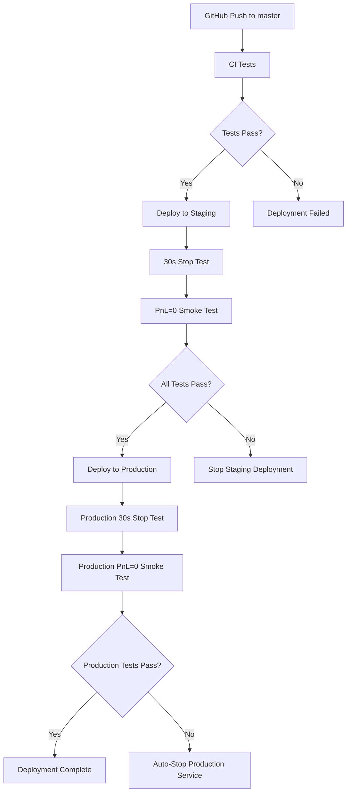

# SOL-Bot Operations Runbook

## 概要

このRunbookは、SOL-Botの運用・保守・トラブルシューティングに関する手順を記載しています。

## デプロイメントパイプライン

### 全体フロー



### ステージング → 本番デプロイフロー

1. **CI/CD テスト** (`ci.yml`)
   - TypeScript ビルド
   - Jest テスト実行 (237 tests)
   - コード品質チェック

2. **ステージング デプロイ** (`deploy-stg.yml`)
   - SSM Parameter Store から環境変数取得
   - EC2 ステージング環境へデプロイ
   - サービス起動・ヘルスチェック

3. **ステージング テスト**
   - TST-085: 30秒停止テスト
   - OPS-009: PnL=0 Smokeテスト

4. **本番 デプロイ** (`deploy-prod.yml`)
   - 手動トリガーまたはmaster push
   - 本番環境への安全なデプロイ
   - Blue/Green対応（将来実装）

5. **本番 テスト**
   - TST-085: 30秒停止テスト
   - OPS-009: PnL=0 Smokeテスト（失敗時自動停止）

## 緊急対応手順

### 1. 緊急停止 (Emergency Stop)

#### 方法A: Kill Switch Flag
```bash
# EC2にSSH接続
ssh ec2-user@<EC2_HOST>

# 緊急停止フラグを作成
sudo touch /opt/solbot-prod/data/kill-switch.flag

# 30秒以内に自動停止します
```

#### 方法B: systemctl Stop
```bash
# ステージング環境停止
sudo systemctl stop bot.service

# 本番環境停止
sudo systemctl stop bot-prod.service
```

#### 方法C: Docker環境停止 (開発環境)
```bash
docker-compose down
```

### 2. サービス状態確認

```bash
# サービス状態確認
sudo systemctl status bot-prod.service

# ログ確認
sudo journalctl -u bot-prod.service -f --lines=50

# API ヘルスチェック
curl -f http://localhost:3001/api/status
curl -f http://localhost:3001/api/account
curl -f http://localhost:3001/metrics
```

### 3. ロールバック手順

#### GitHub Actions経由ロールバック
1. GitHub Actions → `deploy-prod.yml` → `Run workflow`
2. 前の安定版コミットハッシュを指定
3. 手動デプロイを実行

#### 手動ロールバック
```bash
# 1. サービス停止
sudo systemctl stop bot-prod.service

# 2. 前バージョンのバックアップから復元
sudo cp -r /opt/solbot-prod-backup /opt/solbot-prod

# 3. サービス再起動
sudo systemctl start bot-prod.service

# 4. 動作確認
curl -f http://localhost:3001/api/status
```

## 監視・アラート

### メトリクス監視

#### 重要メトリクス
- `solbot_account_balance`: 残高
- `solbot_daily_pnl`: 日次損益
- `solbot_orders_total`: 注文総数
- `solbot_uptime_seconds`: 稼働時間

#### アクセス方法
```bash
# Prometheus メトリクス
curl http://localhost:3001/metrics

# アカウント情報
curl http://localhost:3001/api/account
```

### ログ監視

#### 重要ログファイル
```bash
# systemd ログ
sudo journalctl -u bot-prod.service

# アプリケーションログ
tail -f /opt/solbot-prod/logs/app.log

# エラーログ
grep ERROR /opt/solbot-prod/logs/app.log
```

## トラブルシューティング

### よくある問題と解決法

#### 1. サービス起動失敗
```bash
# 原因調査
sudo systemctl status bot-prod.service
sudo journalctl -u bot-prod.service --no-pager --lines=20

# 解決策
# - 設定ファイル確認: /opt/solbot-prod/.env
# - 権限確認: sudo chown -R solbot:solbot /opt/solbot-prod
# - 依存関係確認: cd /opt/solbot-prod && npm install
```

#### 2. API エンドポイント応答なし
```bash
# ポート確認
sudo netstat -tulpn | grep :3001

# プロセス確認
pgrep -f "node.*index.js"

# ファイアウォール確認
sudo iptables -L | grep 3001
```

#### 3. PnL テスト失敗
- **原因**: 取引実行により dailyPnL が 0 でない
- **対処**: 
  1. 取引停止確認
  2. PnL 値の検証
  3. 設定の見直し
  4. 必要に応じて手動停止

#### 4. メトリクス収集失敗
```bash
# Prometheus 設定確認
curl http://localhost:9090/targets

# メトリクス エンドポイント確認
curl http://localhost:3001/metrics
```

## 保守・メンテナンス

### 定期メンテナンス

#### 週次作業
- [ ] ログファイルのローテーション
- [ ] システムリソース使用量確認
- [ ] バックアップの実行・確認

#### 月次作業
- [ ] 依存関係の更新確認
- [ ] セキュリティパッチ適用
- [ ] パフォーマンス分析

### バックアップ手順

```bash
# アプリケーションバックアップ
sudo tar -czf /tmp/solbot-backup-$(date +%Y%m%d).tar.gz /opt/solbot-prod

# S3へのバックアップ（設定済みの場合）
aws s3 cp /tmp/solbot-backup-$(date +%Y%m%d).tar.gz s3://solbot-backup/
```

## 連絡先・エスカレーション

### 担当者
- **開発チーム**: @nijor
- **インフラチーム**: @assistant  
- **QA チーム**: @qa-team

### Discord通知
- チャンネル: 設定済みWebhook経由
- 通知内容: デプロイ結果、テスト結果、エラーアラート

### エスカレーション基準
- **P0 (Critical)**: 本番サービス停止、資金損失リスク
- **P1 (High)**: 機能不全、予期しない動作
- **P2 (Medium)**: パフォーマンス低下
- **P3 (Low)**: 軽微な問題、改善提案

## セキュリティ

### 機密情報管理
- **環境変数**: AWS SSM Parameter Store で管理
- **APIキー**: SecureString として暗号化保存
- **SSH キー**: GitHub Secrets で管理

### アクセス制御
- **EC2 アクセス**: SSH キー認証のみ
- **GitHub**: OIDC による認証
- **AWS リソース**: 最小権限 IAM ロール

---

## 更新履歴

- 2026-07-11: 初版作成 (OPS-009, OBS-009 対応)
- PnL=0 Smokeテスト、メトリクス監視機能追加